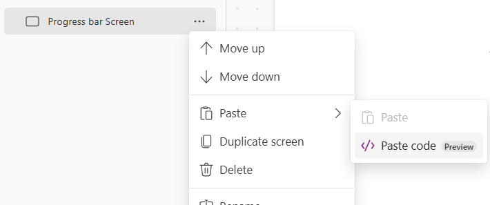

# Progress bar

This is a snippet that creates a progress bar for a canvas app as component. In the progress bar some icons indicates specific information on a specific step. 
It is a gallery in which some logic is added on displaying progress steps. 


## Authors

Snippet|Author
--------|---------
Elianne Burgers | [GitHub](https://github.com/Dutchy365) ([@elianne_tweets](https://twitter.com/elianne_tweets) )

## Minimal path to awesome

> **_NOTE:_** The recommended best practice is to utilize this YAML snippet inside of a canvas component for reusability. While at the moment of publishing this example the pasting code in a component doesn't work. While in sources both yaml files are added.

1. Open your canvas app in **Power Apps**
1. Copy the contents of the **[YAML-file](./source/progressbar-component.pa.yaml)** 
1. Click on the three dots of the screen where you want to add the snippet and select "Paste code"

1. Replace **Items Property** in the gallery with **your data**. 


## Code

``` YAML
- galProgressBar:
    Control: Gallery
    Variant: BrowseLayout_Horizontal_TwoTextOneImageVariant_ver5.0
    Properties:
      OnSelect: |+
        =Set(varCurrentStep, LookUp(colSteps, IsCurrent = true).StepNo);
        Set(varStepToNavigate, ThisItem.StepNo); 


      AccessibleLabel: ="Progress"
      Items: |-
        =Table(
                    {
                        StepName: "Start",
                        StepNo: 0,
                        IsCurrent: true,
                        hasError: 0
                    },
                    {
                        StepName: "1. Self-assessment",
                        StepNo: 1,
                        IsCurrent: false,
                        hasFeedback: 2,
                        hasError: 1
                    },
                    {
                        StepName: "2. Career goals",
                        StepNo: 2,
                        IsCurrent: false,
                        hasFeedback: 3,
                        hasError: 0
                    },
                    {
                        StepName: "3. Learning & development",
                        StepNo: 3,
                        StepScreen: "Steps Screen",
                        IsCurrent: false,
                        hasFeedback: 0,
                        hasError: 2
                    },
                    {
                        StepName: "4. Work-life balance",
                        StepNo: 4,
                        IsCurrent: false,
                        hasFeedback: 1,
                        hasError: 0
                    },
                    {
                        StepName: "Save & Submit",
                        StepNo: 5,
                        IsCurrent: false,
                        hasError: 0
                    }
                )
      BorderColor: =
      BorderStyle: =BorderStyle.None
      DelayItemLoading: =true
      FocusedBorderColor: =
      FocusedBorderThickness: =0.1
      Height: =100
      TabIndex: =0
      TemplateSize: =100
      Width: =Parent.Width
    Children:
    - icoError:
        Control: Classic/Icon
        Variant: Error
        Properties:
          OnSelect: =Select(Parent)
          Tooltip: =
          Color: =RGBA(255, 0, 0, 1)
          Height: =24
          Icon: =Icon.Warning
          Visible: =If(ThisItem.StepNo = 0 || ThisItem.StepNo = Sum(galProgressBar.AllItemsCount - 1), false, If(ThisItem.hasError > 0, true, false))
          Width: =24
          X: =btnCircle.X + Self.Width + 5
          Y: =btnCircle.Y + Self.Height
    - badgeFeedback:
        Control: Badge
        Properties:
          AccessibleLabel: ="Review badge"
          Appearance: ='BadgeCanvas.Appearance'.Filled
          Content: =ThisItem.hasFeedback
          ThemeColor: ='BadgeCanvas.ThemeColor'.Danger
          Height: =24
          Visible: |-
            =If(ThisItem.StepNo = 0 || ThisItem.StepNo = Sum(galProgressBar.AllItemsCount - 1), false, true)

            //If(ThisItem.hasFeedback > 0, true,false)
          Width: =24
          X: =btnCircle.X + Self.Width + 5
          Y: =galProgressBar.Y
    - txtName:
        Control: Text
        Properties:
          Align: ='TextCanvas.Align'.Center
          Font: =Font.'Segoe UI'
          FontColor: =If(ThisItem.IsCurrent, RGBA(16,162,194, 1), RGBA(0, 0, 0, 1))
          Size: =12
          Text: =ThisItem.StepName
          Weight: =If(ThisItem.IsCurrent, FontWeight.Bold, FontWeight.Normal)
          Height: =36
          Width: =Parent.TemplateWidth
          X: =(Parent.TemplateWidth - Self.Width)/2
          Y: =btnCircle.Y+btnCircle.Height
    - btnCircle:
        Control: Button
        Properties:
          OnSelect: =Select(Parent)
          BasePaletteColor: =RGBA(16,162,194, 1)
          BorderRadiusBottomLeft: =Self.Width /2
          BorderRadiusBottomRight: =Self.Width /2
          BorderRadiusTopLeft: =Self.Width /2
          BorderRadiusTopRight: =Self.Width /2
          BorderStyle: =BorderStyle.None
          Icon: =If(ThisItem.StepNo =0, "Home", If(ThisItem.StepNo = Sum(galProgressBar.AllItemsCount -1), "Save", ""))
          Layout: |
            =If(
                ThisItem.StepNo = 0 || ThisItem.StepNo = galProgressBar.AllItemsCount - 1,
                'ButtonCanvas.Layout'.IconOnly,
                'ButtonCanvas.Layout'.TextOnly
            )
          Text: =ThisItem.StepNo
          Height: =41
          Width: =41
          X: =(Parent.TemplateWidth - Self.Width)/2
          Y: =10
    - recBar:
        Control: Rectangle
        Properties:
          OnSelect: =Select(Parent)
          Fill: =RGBA(16,162,194, 1)
          Height: =6
          Visible: =ThisItem.IsCurrent
          Width: =Parent.TemplateWidth
          Y: =Parent.Height - 16

```


