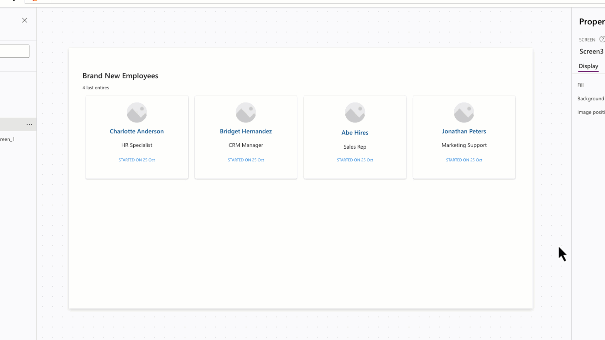
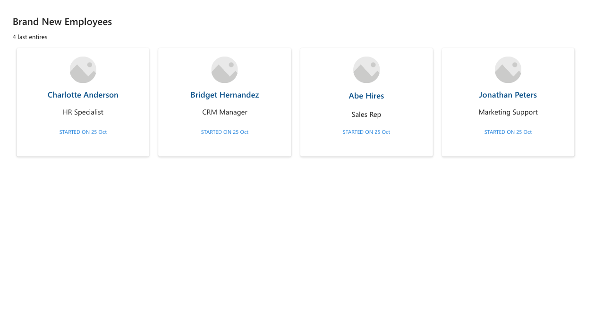

# Responsive People Cards

This snippet shows how to implement a responsive gallery of clickable people cards.

- The card are data driven using the Items collection.

- Each card shows an image, name placeholder, job title placeholder and start date placeholder.

- Cards are clickable.

- Cards will re-flow as the width of the app reduces. The heigh of the container is dynamically calculated to accommodate the wrapped cards.

   

## Authors

Snippet|Author(s)
--------|---------
April Dunnam | [GitHub](https://github.com/aprildunnam) ([@aprildunnam](https://www.twitter.com/aprildunnam) )

## Code

```yaml
- Container2FunnelScreen_1:
    Control: GroupContainer
    Variant: horizontalAutoLayoutContainer
    Properties:
      DropShadow: =DropShadow.None
      Height: =600
      LayoutDirection: =LayoutDirection.Vertical
      LayoutMode: =LayoutMode.Auto
      PaddingBottom: =10
      PaddingLeft: =40
      PaddingRight: =40
      PaddingTop: =20
      Width: =1353
      Y: =40
    Children:
    - TextCanvas5_1:
        Control: Text
        Properties:
          Size: =22
          Text: ="Brand New Employees"
          Weight: ='TextCanvas.Weight'.Semibold
          Height: =40
          Width: '=Parent.Width - 50   '
    - TextCanvas6_1:
        Control: Text
        Properties:
          Text: =CountRows(galNewHires_1.AllItems) &" last entires"
    - galNewHires_1:
        Control: Gallery
        Variant: BrowseLayout_Vertical_TwoTextOneImageVariant_ver5.0
        Properties:
          Items: =Table({Name:"Charlotte Anderson",JobTitle:"HR Specialist", Start:Today(),Image:SampleImage},{Name:"Bridget Hernandez",JobTitle:"CRM Manager", Start:Today(),Image:SampleImage}, {Name:"Abe Hires",JobTitle:"Sales Rep", Start:Today(),Image:SampleImage},{Name:"Jonathan Peters",JobTitle:"Marketing Support", Start:Today(),Image:SampleImage})
          WrapCount: |-
            =IfError(RoundDown(
                            Self.Width/
                            Max(300,(Self.Width/Self.AllItemsCount))
                        ,0),3)
          DelayItemLoading: =true
          Layout: =Layout.Vertical
          LoadingSpinner: =LoadingSpinner.Data
          TemplatePadding: =0
          TemplateSize: =300
        Children:
        - Container7_1:
            Control: GroupContainer
            Variant: manualLayoutContainer
            Properties:
              DropShadow: =DropShadow.Semilight
              Height: =244
              Width: =Parent.TemplateWidth - 20
              X: =9
              Y: =9
            Children:
            - Image6_1:
                Control: Image
                Properties:
                  OnSelect: =
                  Image: =ThisItem.Image
                  Height: =60
                  RadiusBottomLeft: =60
                  RadiusBottomRight: =60
                  RadiusTopLeft: =60
                  RadiusTopRight: =60
                  Width: =60
                  X: =(Parent.Width - Self.Width) / 2
                  Y: =19
            - TextCanvas7_3:
                Control: Text
                Properties:
                  Align: ='TextCanvas.Align'.Center
                  FontColor: =App.Theme.Colors.Darker20
                  Size: =18
                  Text: =ThisItem.Name
                  Weight: ='TextCanvas.Weight'.Semibold
                  Width: =Parent.Width
                  Y: =92
            - TextCanvas7_4:
                Control: Text
                Properties:
                  Align: ='TextCanvas.Align'.Center
                  Size: =16
                  Text: =ThisItem.JobTitle
                  Width: =Parent.Width
                  Y: =133
            - TextCanvas7_5:
                Control: Text
                Properties:
                  Align: ='TextCanvas.Align'.Center
                  FontColor: =App.Theme.Colors.Lighter10
                  Size: =12
                  Text: ="STARTED ON "& Text(ThisItem.Start,"dd mmm")
                  Width: =Parent.Width/2
                  X: =(Parent.Width - Self.Width) / 2
                  Y: =180
```

## Minimal path to awesome

1. Open your canvas app in **Power Apps**
1. Copy the contents of the **[YAML-file](./source/peoplecard.pa.yaml)** or copy it from the code above.
1. Right click on the screen where you want to add the snippet and select "Paste YAML"


This will add the gallery and header to your screen and you can customize the items property to dynamically get data.



## Disclaimer

**THIS CODE IS PROVIDED *AS IS* WITHOUT WARRANTY OF ANY KIND, EITHER EXPRESS OR IMPLIED, INCLUDING ANY IMPLIED WARRANTIES OF FITNESS FOR A PARTICULAR PURPOSE, MERCHANTABILITY, OR NON-INFRINGEMENT.**


