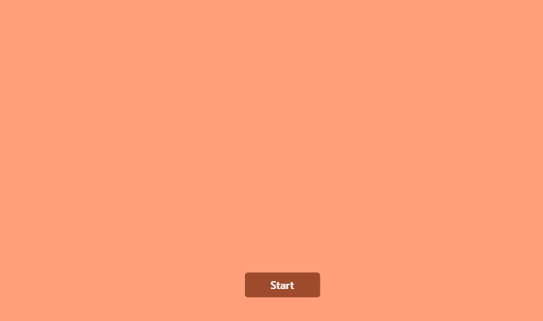

# Loading spinner

This is a snippet that creates a loading spinner with a user experience to add a visual sense to the user waiting for the app. The messaging can make the wait feel shorter, even if the actual load time is the same. Add some personality with your own branded messages to make the experience even better.

An image of how it can look like:


The final result is a spinner with a label that displays randomly changing text.



## Authors

Snippet|Author
--------|---------
Elianne Burgers | [GitHub](https://github.com/Dutchy365) ([@elianne_tweets](https://twitter.com/elianne_tweets) )

## Minimal path to awesome

1. Open your canvas app in **Power Apps**
1. Copy the contents of the **[YAML-file](./source/spinner-loadingtext.pa.yaml)** 
1. Click on the three dots in the app where you want to add this and select "Paste code"

1. Replace **OnTimerEnd** in the tmrProgressMessage to your **own type of progress messages **. 


> **_NOTE:_** Please note: To view the effect, switch to Play mode — it doesn’t always work in Studio mode.

## Code

``` YAML
Screens:
  Spinner Screen:
    Properties:
      Fill: =Color.LightSalmon
      LoadingSpinnerColor: =RGBA(56, 96, 178, 1)
    Children:
      - tmrShowSpinner:
          Control: Timer@2.1.0
          Properties:
            AutoPause: =false
            BorderColor: =ColorFade(Self.Fill, -15%)
            Color: =RGBA(255, 255, 255, 1)
            DisabledBorderColor: =ColorFade(Self.BorderColor, 70%)
            DisabledColor: =ColorFade(Self.Fill, 90%)
            DisabledFill: =ColorFade(Self.Fill, 70%)
            Duration: =10000
            Fill: =RGBA(56, 96, 178, 1)
            Font: =Font.'Open Sans'
            HoverBorderColor: =ColorFade(Self.BorderColor, 20%)
            HoverColor: =RGBA(255, 255, 255, 1)
            HoverFill: =ColorFade(RGBA(56, 96, 178, 1), -20%)
            OnTimerEnd: |-
              =UpdateContext({varShowSpinner: false})
            PressedBorderColor: =Self.Fill
            PressedColor: =Self.Fill
            PressedFill: =Self.Color
            Start: =varShowSpinner
            Visible: =false
            X: =80
            Y: =201
      - tmrProgressMessage:
          Control: Timer@2.1.0
          Properties:
            AutoPause: =false
            BorderColor: =ColorFade(Self.Fill, -15%)
            Color: =RGBA(255, 255, 255, 1)
            DisabledBorderColor: =ColorFade(Self.BorderColor, 70%)
            DisabledColor: =ColorFade(Self.Fill, 90%)
            DisabledFill: =ColorFade(Self.Fill, 70%)
            Duration: =2000
            Fill: =RGBA(56, 96, 178, 1)
            Font: =Font.'Open Sans'
            HoverBorderColor: =ColorFade(Self.BorderColor, 20%)
            HoverColor: =RGBA(255, 255, 255, 1)
            HoverFill: =ColorFade(RGBA(56, 96, 178, 1), -20%)
            OnTimerEnd: |
              =UpdateContext({varProgressMessage: 
                 Switch(
                    RandBetween(1, 6), 
                    1, "⌛Loading data, please wait...", 
                    2, "Processing your request...", 
                    3, "⏳Almost there...", 
                    4, "Fetching results...", 
                    5, "Finalizing...",
                    6, "☕Drinking coffee"
                 )})
            PressedBorderColor: =Self.Fill
            PressedColor: =Self.Fill
            PressedFill: =Self.Color
            Repeat: =varShowSpinner
            Start: =varShowSpinner
            Visible: =false
            X: =71
            Y: =80
      - spnLoadingData:
          Control: Spinner@1.4.6
          Properties:
            AccessibleLabel: ="Spinner loading data"
            BasePaletteColor: =Color.LightSalmon
            Font: =Font.'Segoe UI'
            FontColor: =RGBA(0, 0, 0, 1)
            FontSize: =22
            FontWeight: =FontWeight.Normal
            Height: =Parent.Height
            Label: =varProgressMessage
            LabelPosition: ='Spinner.LabelPosition'.Below
            SpinnerColor: =RGBA(240, 98, 15, 1)
            SpinnerSize: ='Spinner.SpinnerSize'.Huge
            TrackColor: =RGBA(253, 207, 180, 1)
            Visible: =varShowSpinner
            Width: =Parent.Width
      - btnStart:
          Control: Button@0.0.44
          Properties:
            BasePaletteColor: =RGBA(246, 142, 104, 1)
            OnSelect: =UpdateContext({varShowSpinner:!varShowSpinner})
            Text: ="Start"
            Visible: =!varShowSpinner
            X: =(Parent.Width- Self.Width)/2
            Y: =510

```

## Disclaimer

**THIS CODE IS PROVIDED *AS IS* WITHOUT WARRANTY OF ANY KIND, EITHER EXPRESS OR IMPLIED, INCLUDING ANY IMPLIED WARRANTIES OF FITNESS FOR A PARTICULAR PURPOSE, MERCHANTABILITY, OR NON-INFRINGEMENT.**


