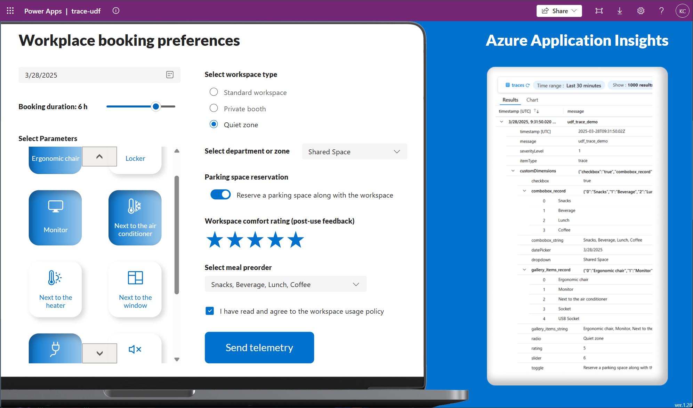
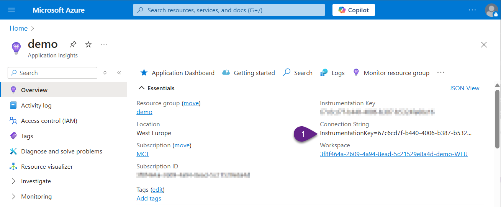
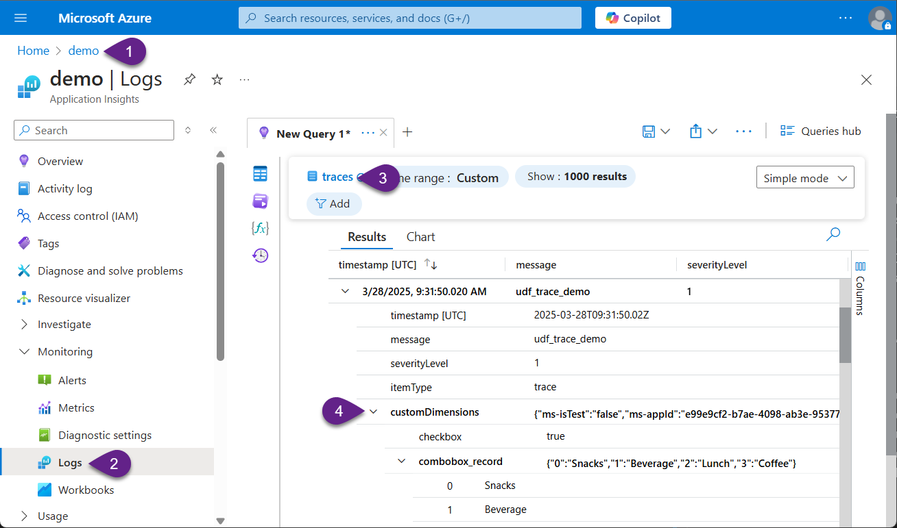

# Send telemetry logs with User Defined Functions to Azure Application Insights

This snippet demonstrates how to implement telemetry logging in Power Apps using User Defined Functions (UDFs) and Azure Application Insights. It showcases the definition and application of UDFs to efficiently manage and send telemetry data.

## Problem statement

Telemetry collection is crucial for developing and enhancing apps. In Power Apps, developers use the `Trace()` function to send telemetry logs to Azure Application Insights.

However, using this function independently often results in inconsistencies in trace parameters, message formats, and severity levels. These variations can lead to errors and lack a standardized approach, affecting the reliability and usefulness of the data collected. Additionally, without properly preparing the data for logging, it could also cause redundant nests, making the logs harder to parse and analyze effectively.

## Solution

By implementing a standardized `User Defined Function (UDF)` for telemetry, it's possible to ensure consistent data collection, minimize errors, and improve the analysis and utility of application insights.

## Authors

Author|Socials
--------|---------
Katerina Chernevskaya | [GitHub](https://github.com/Katerina-Chernevskaya/) - [LinkedIn](https://www.linkedin.com/in/katerinachernevskaya/)

## Prerequisites

1. Existing Azure Application Insights resource. Learn more how to create Azure Application Insights resource [here](https://learn.microsoft.com/en-us/azure/azure-monitor/app/create-workspace-resource?tabs=portal).

2. Connect your Power Apps Canvas app to Application Insights. You can follow the [official guide](https://learn.microsoft.com/en-us/power-apps/maker/canvas-apps/application-insights#connect-your-app-to-application-insights) or use the steps below:
   - Go to your Application Insights resource in Azure. On the **Overview** page, locate and copy the **Connection String**:
   
   - In Power Apps Studio, select the **App** level, then navigate to the **Connection string** property on the right-hand pane and paste the copied value:
   

3. Make sure that experimental features are enabled: 
   - User-defined functions
   - User-defined types
   

4. Power Apps Canvas app with the following controls (name the controls the same as in the list below). You can use the [sample screen snippet](./source/screen.pa.yaml) to quickly add a preconfigured screen with all necessary controls.
   - DatePicker
   - Slider
   - Gallery
   - RadioGroup
   - Dropdown
   - Toggle
   - Rating
   - Combobox
   - Checkbox
   - Button

## Minimal path to awesome

1. Open your Power App in edit mode
2. Copy the contents of the **[udf.fx](./source/udf.fx)**
3. Add the copied code into `Formula` property on the `App` level
4. *(Optional: if you didn't create the screen with the [sample screen snippet](./source/screen.pa.yaml))* Copy the contents of the **[onselect.fx](./source/onselect.fx)** and insert the copied code into the `OnSelect` property of the Button
5. Make sure the screen with controls is easily accessible - either move it to a higher position in the screen list or add a navigation control to reach it. Save the app and publish it
6. Play the app, test the button to send telemetry to Azure Application Insights
7. Navigate to the Azure Application Insights resource. Open the `Logs` under `Monitoring`. Select `trace` table. You will see the collected telemetry under the `customDimensions`

## Disclaimer

**THIS CODE IS PROVIDED *AS IS* WITHOUT WARRANTY OF ANY KIND, EITHER EXPRESS OR IMPLIED, INCLUDING ANY IMPLIED WARRANTIES OF FITNESS FOR A PARTICULAR PURPOSE, MERCHANTABILITY, OR NON-INFRINGEMENT.**

